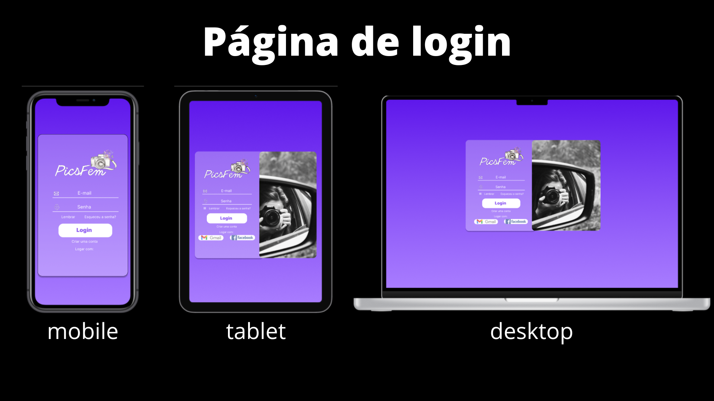
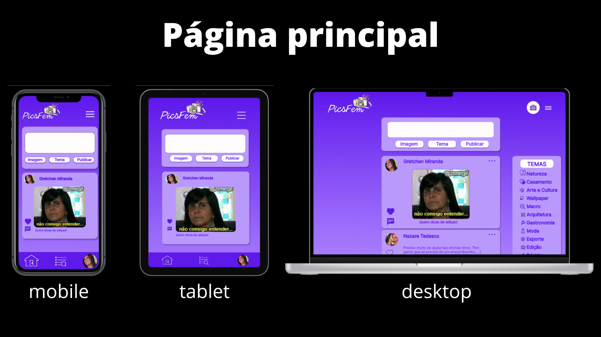
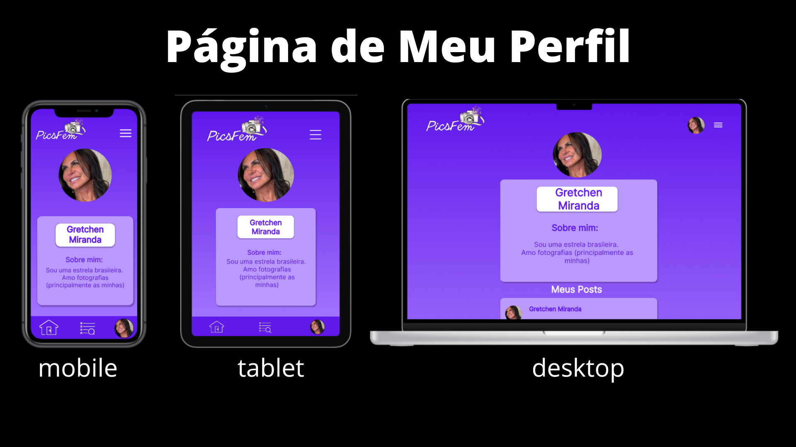
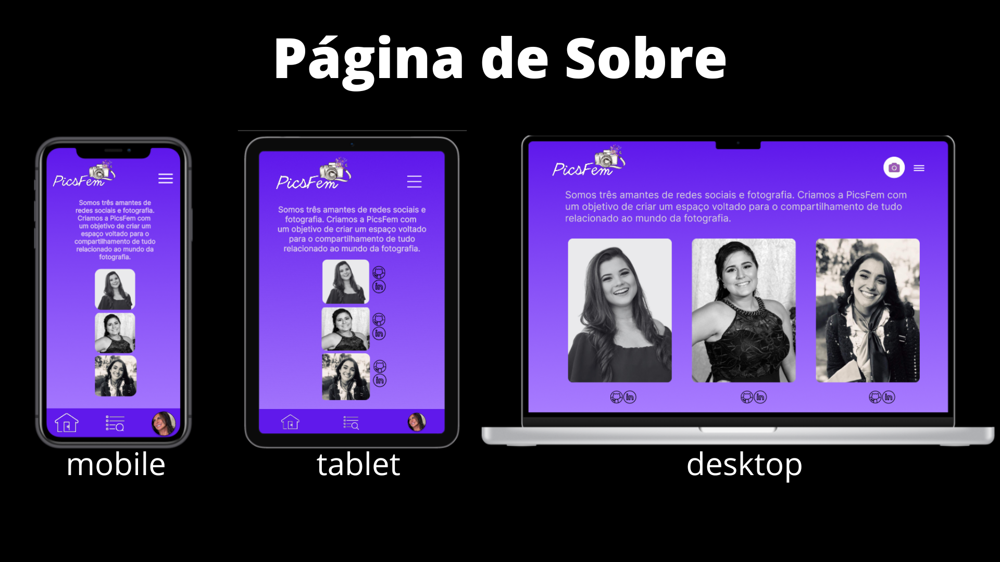
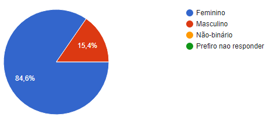
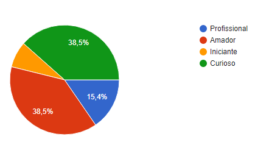

# PicsFem

## Índice

* [1. Resumo do projeto](#1-resumo-do-projeto)
* [2. Boilerplate](#2-boilerplate)
* [3. Definição de produto](#3-definição-de-produto)
* [4. Histórias de usuário](#4-histórias-de-usuário)
* [5. Desenho da Interface de Usuário](#5-desenho-da-interface-de-usuário)
* [6. Sobre as Desenvolvedoras](#6-sobre-as-desenvolvedoras)

***

## 1. Resumo do projeto

PicsFem é uma rede social desenvolvida para mulheres amantes de fotografia. O seu objetivo principal é construir uma comunidade segura para que mulheres que amam fotografia possam: compartilhar conhecimentos e dicas; se apoiar; aperfeiçoar técnicas; além de debater e sanar dúvidas técnicas e não técnicas sobre o tema.

Nome das usuárias: PicFemers(?).

De acordo com pesquisas realizadas durante o desenvolvimento do projeto, relatou-se que mulheres fotógrafas possuem um grande desafio para adentrar no mercado de fotografia, pois este ainda é marjoritariamente masculino. Uma das futuras funcionalidades criadas seria a possibilidade de clientes poderem contratar mulheres fotógrafas para trabalhos freelancers através da PicsFem.

- Um desafio relatado por fotógradas mulheres: o mercado ainda é muito masculino
- Quem são os principais usuários do produto: mulheres amantes de fotografia.
- Qual problema o produto resolve/para que ele serve para esses usuários: 

## 2. Boilerplate

## 3. Definição de produto

PicsFem é uma rede social desenvolvida para mulheres amantes de fotografia. O seu objetivo principal é construir uma comunidade segura para que mulheres que amam fotografia possam: compartilhar conhecimentos e dicas; se apoiar; aperfeiçoar técnicas; além de debater e sanar dúvidas técnicas e não técnicas sobre o tema.

## 4. Histórias de usuário

### História 1: Eu como fotógrafa profissional, gostaria de me cadastrar e, em seguida, fazer o meu login, utilizando o meu gmail de forma prática, com o objetivo de otimizar o meu tempo.
Definimos que essa história estava pronta quando: finalizou-se a SPA; a página de login estava responsiva para todas as telas; construiu-se o teste da função de logar com o google; recebeu-se o code review de pelo menos uma parceira de equipe; finalizou-se os testes manuais e os testes de usabilidade; e realizou-se o deploy com o git tag.

Testes manuais e de usabilidade: 
Após fazermos os testes manuais e de usabilidade, incorporamos os feedbacks dados pelos usuários, e fizemos as seguintes mudanças.
a) Tiramos a fotografia do layout da página de login para os tablets, pois o usuário reclamou que o formulário não ficava tão legível, já que a imagem achatava o seu design.
b)Colocamos o botão de voltar no formulário de criar conta, pois o usuário relatou que sentiu dificuldade em retornar para a página anterior, além de não ter ficado claro para ele como retornava.

### História 2: Eu como entusiasta de fotografias, gostaria de publicar dicas sobre edição de fotos com o objetivo de compartilhar meus conhecimentos com a comunidade. Porém, também, gostaria de editar ou removê-las depois, para melhorar a qualidade das publicações.

### História 3: mo PicsFemer, eu gostaria de interagir com as minhas outras colegas de comunidade através de likes e comentários, com o objetivo de me conectar melhor com elas.

### História 4: E, como usuária de redes sociais, gostaria de poder sair da minha conta da PicsFem, com o objetivo de não deixar tantas contas de redes sociais abertas ao mesmo tempo. 

## 5. Desenhos da Interface de Usuário

### Protótipo de baixa fidelidade

### Protótipos de alta fidelidade

## 6. Desenhos da Interface de Usuário

Um dos objetivos de aprendizagem do projeto era realizar entrevistas com os possíveis usuários. Para isso utilizamos um form do google docs como ferramenta, e neste criamos um formulário para compreender o perfil dos nossos possíveis usuários e analisar suas necessidades.
A priori, precisávamos conhecer o nosso público. Logo, iniciamos o questionário com perguntas como: nome, idade e como o usuário se identifica como pessoa. Dessa forma, foi identificado que nosso público seria majoritariamente feminino e em idades diversas.

Após a primeira identificação de nosso usuário, buscamos entender o seu perfil em relação ao propósito do site e a sua configuração pessoal, já que a aplicação web construída é voltada para o público amante de fotografia. Portanto, analisou-se as características vigentes e os possíveis interesses em utilizar o produto. Além disso, coletou-se: temas de interesse, relatos visando uma melhor usabilidade do produto e sugestões de possíveis implementações futuras. 

Ao final da pesquisa, ficamos felizes com o resultado obtido, o qual foi muito importante para o direcionamento do desenvolvimento do projeto, além de nos dar visão para implementações futuras, mediante possíveis investimentos.

## 7. Sobre as Desenvolvedoras
Projeto desenvolvido por Amanda Holanda [Linkedin](https://www.linkedin.com/in/amandaholanda/) | [GitHub](https://github.com/amanda-holanda), Isabella Lima [Linkedin]() | [GitHub]() & Gleyciane Macena [Linkedin]() | [GitHub]().

