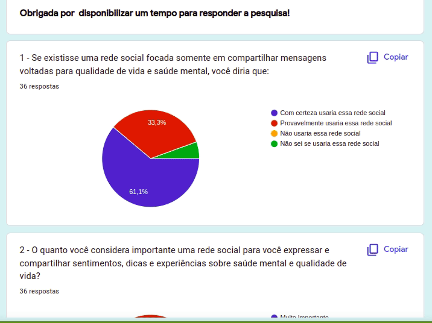
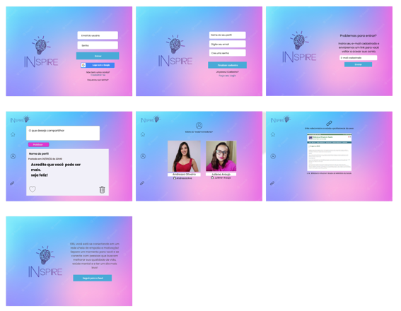

# INspire - Uma rede que inspira e conecta pessoas que buscam melhorar sua qualidade de vida e saúde mental

  

  Confira [ aqui ](https://juliene-araujo.github.io/SAP008-social-network/) o resultado final! 

## Índice

* [1. Apresentação](#1-apresentação)
* [2. Resumo do projeto](#2-resumo-do-projeto)
* [3. Pesquisa de usuários](#3-pesquisa-de-usuário)
* [4. Histórias de usuários](#4-histórias-de-usuários)
* [5. Protótipo](#5-protótipo)
* [6. Teste de usabilidade](#6-teste-de-usabilidade)
* [7. Planejamento](#7-planejamento)
* [8. Considerações técnicas](#8-considerações-técnicas)
* [9. Desenvolvedoras](#9-desenvolvedoras)

***

## 1. Apresentação

Esse foi o terceiro projeto desenvolvido pelo bootcamp da Laboratoria e tem como principal objetivo a construção de uma rede social com múltiplas telas em Vanilla JavaScript que seja responsiva a partir do método Single-page Application (SPA) e  que permita o usuário:

- criar conta de acesso;
- logar-se com e-mail e senha;
- logar com o Google;
- criar, editar e deletar publicações;
- dar likes e dislikes nas publicações. 

## 2. Resumo do projeto

Diariamente estamos conectados em diversas redes socias sujeitos a diferentes conteúdos que nem sempre podemos filtrar. Pensando neste contexto, a rede INspire surgiu da necessidade de ter uma rede social com um ambiente acolhedor, livre de mensagens nocivas que possam impactar de maneira negativa no dia a dia.

**Qual a necessidade busca resolver? E para quem?**

Segundo a Organização Mundial da Saúde (OMS) no primeiro ano de pandemia de COVID-19, a prevalência global de ansiedade e depressão aumentou em 25%. 
A Folha de São Paulo destacou que os Brasileiros se preocupam mais com a saúde mental do que com o câncer. Essa foi a constatação da pesquisa "Monitor Global dos Serviços de Saúde", feita pelo Instituto Ipsos.
De acordo com o levantamento, 49% dos entrevistados no Brasil apontaram o bem-estar psicológico como o principal fator de preocupação. A sondagem foi realizada entre julho e agosto de 2022, com 23.507 pessoas, em 34 países

Dado esse contexto e pensando em remodelar os ambientes que influenciam nossa vida e fortalecer o cuidado com a saúde mental, a aplicação tem o objetivo de conectar pessoas que buscam melhorar sua qualidade de vida e saúde mental, por meio de informações, links relacionados e apoio, tendo em vista que muitas pessoas relataram não ter espaço onde possam se expressar e serem acolhidas de alguma forma.

Por meio de um ambiente seguro, construímos um espaço com informações relacionadas ao tema que possibilitam a troca de experiências livre de discriminação e julgamento. Nela o usuário tem um espaço para ser ouvido e para compartilhar aquilo que lhe faz bem e possa ajudar outras pessoas a ter um dia melhor.

## 3. Pesquisa de usuários

Para conhecer os usuários, realizamos uma pesquisa utilizando a ferramenta Google Forms. A partir desta pesquisa foi possível traçar o perfil das personas, identificar as necessidades dos usuários e elaborar a interface da aplicação.

- Formulário da pesquisa aplicado com os possíveis usuários:

  

- Resultado da pesquisa:

  

## 4. Histórias de usuários

Com base nas pesquisas com os usuários, elaboramos 3 histórias de usuário:

**História do usuário 1:**

"Eu como usuária de redes sociais gostaria de logar na aplicação com e-mail e senha para criar uma conta em um ambiente mais seguro."

- Critérios de aceitação: 
   - Página de cadastro e login

**História do usuário 2:**

"Eu como usuária de redes sociais, gostaria de me logar com minha conta do google para acessar a aplicação mais rápido sem precisar fazer um cadastro."

- Critérios de aceitação: 
   - Página de login com campo para logar com o google

**História do usuário 3:**

"Eu gostaria de uma ambiente seguro para me expressar e compartilhar o que me faz bem, por meio de posts e ter a opção de editar e removê-lo."

- Critérios de aceitação:
  - Botão de editar e remover publicação somente do usuário que realizou aquela publicação.

**História do usuário 4:**

"Eu como usuária da rede social, gostaria de interagir com as publicações dos outros usuários por meio de curtidas, com o objetivo de me acolher e apoior meus colegas de rede."

- Critérios de aceitação:
  - Botão de like e remover like nas publicações do feed

**Definição de pronto**

- As páginas estavam responsivas para todas as telas nas versões mobile e desktop;
- A aplicação é uma SPA (Single Page Application);
- Construiu-se o teste das funções auth e de firestore;
- O usuário pode publicar, editar, deletar, dar like e dislike nas publicações;
- O usuário pode se manter logado ou sair da sua conta;
- Realizou-se o deploy usando o git tag.

## 5. Protótipos

### 5.1 Protótipo de baixa fidelidade

Protótipo da versão mobile elaborado pelo aplicativo canva:

  

### 5.2 Protótipo de alta fidelidade

Protótipo da versão mobile elaborado pelo aplicativo Figma:

  

Protótipo da versão desktop elaborado pelo aplicativo Figma:

  

## 6. Teste de usabilidade

Após fazermos os testes manuais e de usabilidade, realizamosa s seguintes alterações:

- Incluimos o campo "Faça seu login?" para voltar para o login após realizar o pedido de alteração de senha;
- Criamos a tela de "Boas Vindas" após o usuário realizar o cadastro;
- Removemos o campo de nome completo e colocamos apenas o campo com o nome que o usuário gostaria de ser chamado.

## 7. Planejamento

O projeto foi elaborado pela ferramenta **Notion** em Quadro Kanban, com tasks em 'baby steps', divididas por sprints. 
Confira [aqui](https://www.notion.so/5a8492bb61c54a628c9a37e96f352133?v=94b992aed19f46d181a3284bcfdb5f84) todo o nosso planejamento.

## 8. Considerações técnicas

A lógica do projeto foi integrada somente em JavaScript (ES6), HTML e CSS. Neste projeto não está permitido o uso de bibliotecas e frameworks, apenas vanilla JavaScript , com exceção da biblioteca Firebase para gerenciamento de usuário e base de dados.

**Ferramentas utilizadas**

- Canva
- Figma;
- Notion;
- Git/GitHub;
- Firebase;
- Visual Studio Code.

**Critérios de aceitação**

- Ser uma SPA.
- Ser responsivo.
- Receber revisão de código da equipe.
- Fazer testes unitários.
- Fazer testes manuais buscando erros e imperfeições simples.
- Fazer testes de usabilidade e incorporar o feedback dos usuários como melhorias.
- Fazer deploy do aplicativo e marcar a versão (git tag).

**Objetivos de aprendizagem**

- HTML - HTML semântico
- CSS - seletores de CSS, box model, flexbox, Grid Layout
- APIs da Web - seletores de DOM, Manipulação de eventos de DOM, Manipulação dinâmica de DOM, Roteamento (API de histórico, evento hashchange, window.location);
- JavaScript - arrays, objetos, variáveis ​​(declaração, atribuição, escopo), uso de condicionais, laços, etc;
- Testes unitários;
- ESLINT;
- Promessas;
- Controle de Versões (Git e GitHub);
- Design de produto;
- Planejar e executar testes de usabilidade;
- Firebase.

## 9. Desenvolvedoras

Este projeto foi realizado em dupla por:

* Andressa Oliveira [ Linkedin ](https://www.linkedin.com/in/andressa-oliveira-front-end/) | [ GitHub ](https://github.com/Andressaolive)
* Juliene Araujo [ Linkedin ](https://www.linkedin.com/in/juliene-araujo/) | [ GitHub ](https://github.com/Juliene-Araujo)
